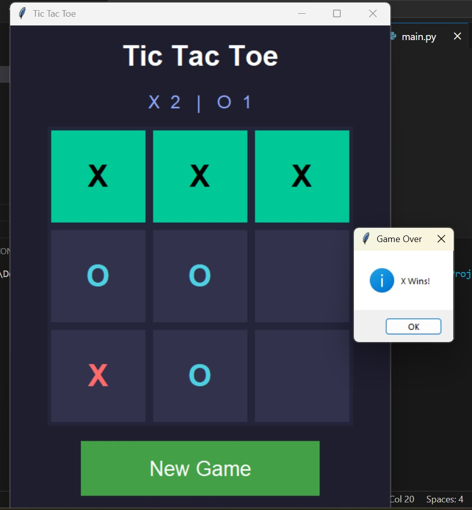

# 🎮 Tic Tac Toe – Python (Tkinter GUI)

A modern and visually polished Tic Tac Toe game built using Python and Tkinter,  featuring a clean dark UI, real-time score tracking, and structured OOP design. 

## 🚀 Features
- 🎨 Modern Dark Themed UI
- ⭕ vs ❌Two Player Mode (O vs X)
- 🏆 Automatic Win Detection (Rows, Columns, Diagonals)
- 📊 Live Scoreboard
- 🔄 Reset Board & New Game Option
- 💡 Highlighted Winning Combination
- 🧠 Clean OOP-Based Code Structure

---

## 🖼️ Preview

---

## 🛠️ Built With
- Python 3
- Tkinter (GUI Library)

---

No external dependencies required.

## 📂 Project Structure
PROJECT-TIC-TAC-TOE/

├── .gitignore

├── main.py

├── README.md

├── requirements.txt

└── Screenshot.png

---

## ▶️ How to Run
Make sure Python 3 is installed.
Clone the repository:
git clone https://github.com/JAY007-think/PROJECT-Tic-Tac-Toe
Navigate to the folder:
open terminal: 
    Run the program:
        python main.py

---

## 🧠 How It Works
- The game uses a 3x3 grid of Tkinter buttons
- Each move updates the internal state
- The program checks:
   - Rows
   - Columns
   - Diagonals
- If a winner is found:
   - Winning cells are highlighted
   - Score is updated
   - Board resets automatically
- The project follows a structured OOP design:
- create_widgets() → UI setup
- on_click() → Move handling
- check_winner() → Win detection
- update_score() → Score management
- reset_board() → Game reset

---

## 📈 Future Improvements
- 🤖 AI Opponent (Minimax Algorithm)
- 🎚 Difficulty Levels
- 🌈 Theme Toggle (Dark / Light Mode)
- 🔊 Sound Effects
- 🎯 Turn Indicator Label
- 🧩 Custom Board Sizes (4x4, 5x5)
- 🎓 Learning Outcomes

---

## This project helped reinforce:
- Object-Oriented Programming (OOP)
- Event-driven programming
- GUI design with Tkinter
- State management
- Basic game logic implementation

## 📜 License
This project is open-source and free to use.

## 👨‍💻 Author

**Jay Soni**

Python Developer 🚀

LinkedIn: https://www.linkedin.com/in/jay-soni-01a791261/

LeetCode: https://leetcode.com/u/ZysIunJ150/

> This project was built as a learning exercise

